# Architecture

> Overview of the claude-channel-mux system architecture.

## System Overview

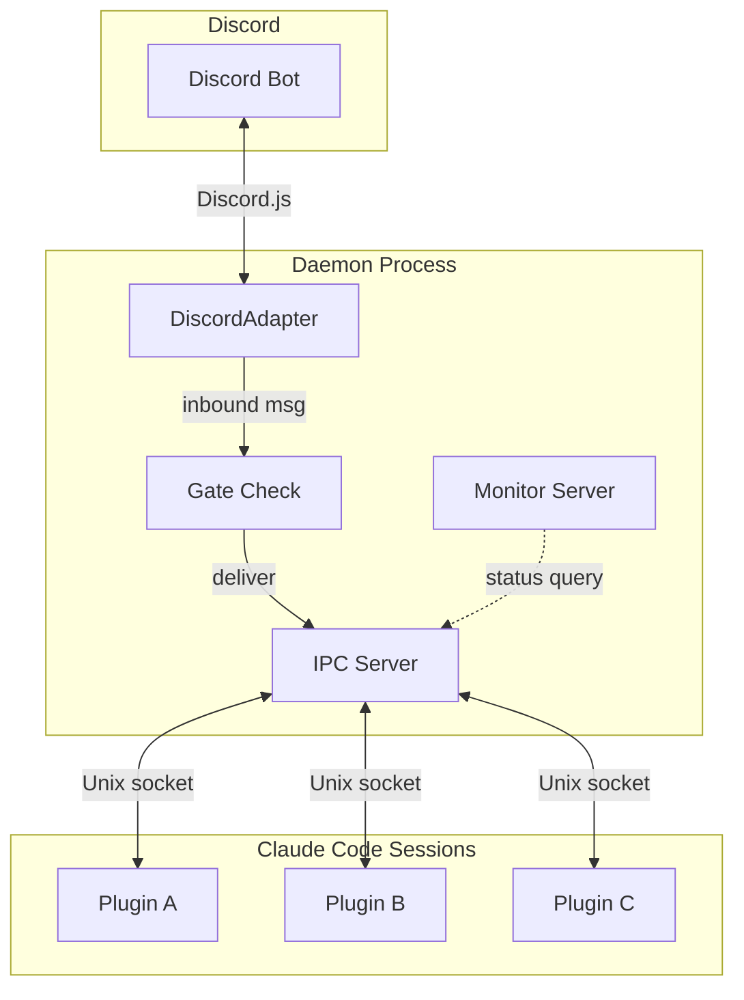

The daemon holds a single Discord bot connection and multiplexes messages to multiple Claude Code sessions via Unix socket IPC. Each session runs as an MCP server plugin that connects to the daemon.

## Package Dependency Graph

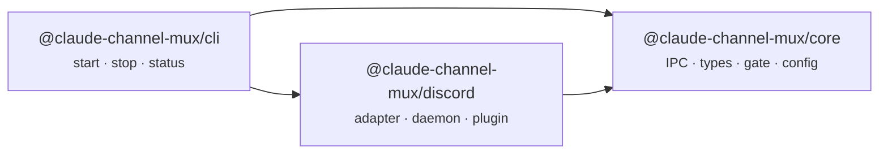

| Package | Responsibility |
|---|---|
| **core** | Platform-agnostic: IPC protocol, types, gate logic, config paths |
| **discord** | Platform-specific: Discord.js adapter, daemon wiring, MCP plugin |
| **cli** | Daemon process management (start/stop/status) |

## Message Flow: Inbound (Discord to Claude)

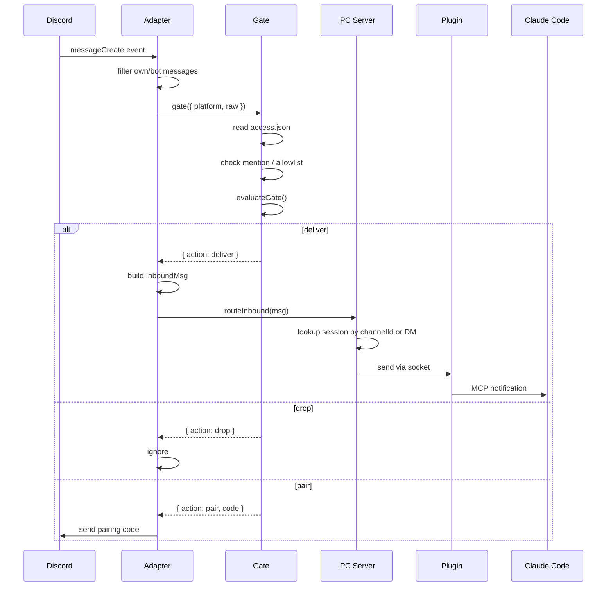

## Message Flow: Outbound (Claude to Discord)

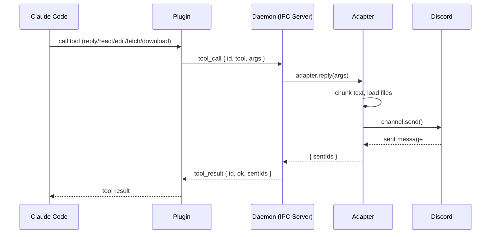

## Session Registration

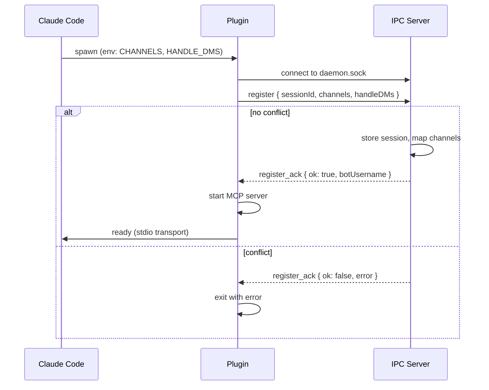

Session claims are exclusive: one session per channel, one session for DMs. Re-registration from the same session ID releases old claims first.

## Access Control (Gate)

Gate logic is pure (no platform deps) in `core/gate.ts`. The Discord adapter resolves mentions and reads `access.json` before delegating to the pure function.

**DM messages:**

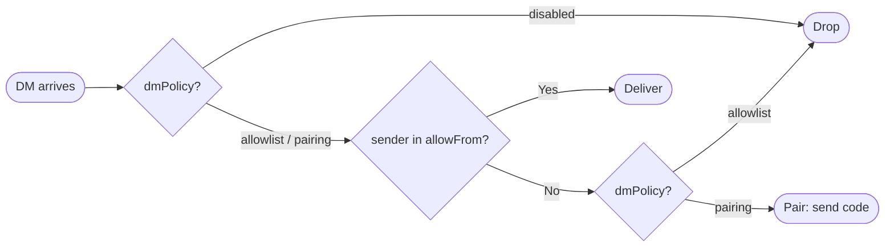

**Guild messages:**

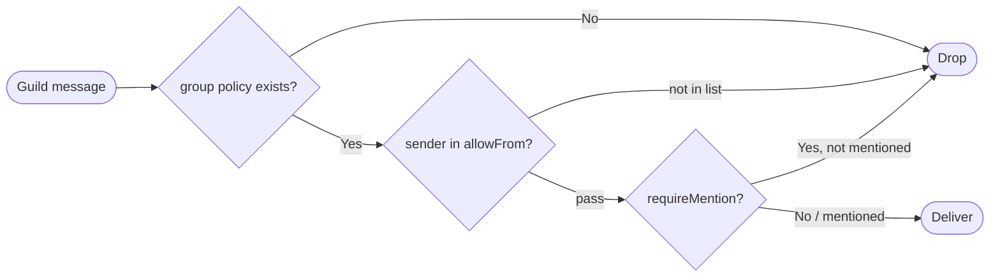

## State Directory

All runtime state lives in `~/.claude/channels/channel-mux/`.

### User Config

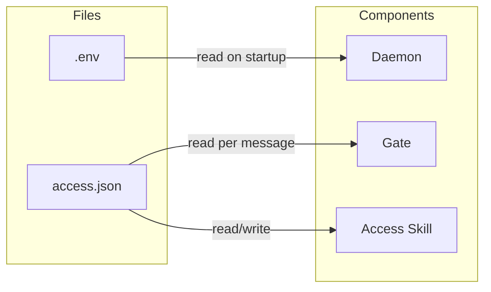

| File | Description |
|---|---|
| `.env` | Bot token (`DISCORD_BOT_TOKEN`), monitor port, etc. |
| `access.json` | Access control: DM policy, channel groups, allowlists |

### Daemon Lifecycle

Ephemeral files -- created on startup, cleaned up on shutdown or by `channel-mux stop`.

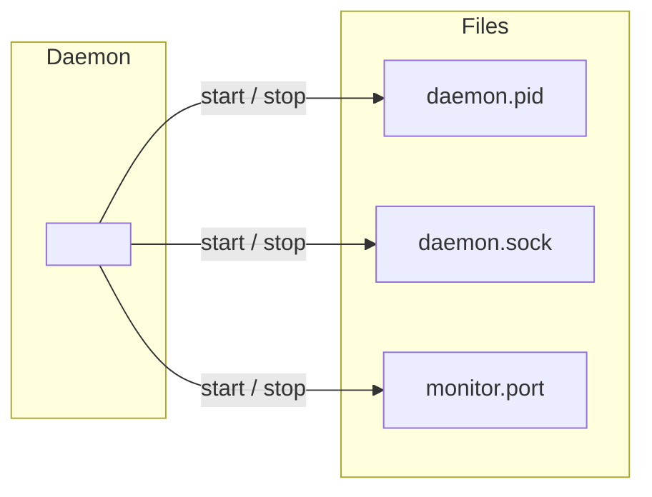

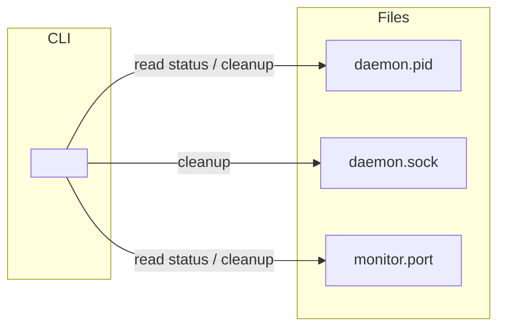

### Pairing Bridge

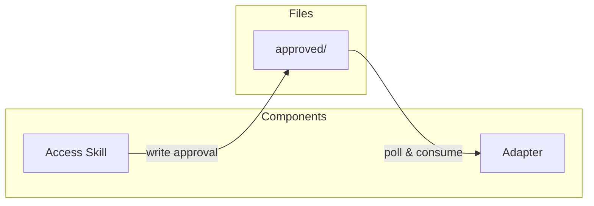

The `approved/` directory bridges the terminal skill and the daemon. The skill writes a file per approved user; the adapter polls and deletes it after sending confirmation.

### Attachments

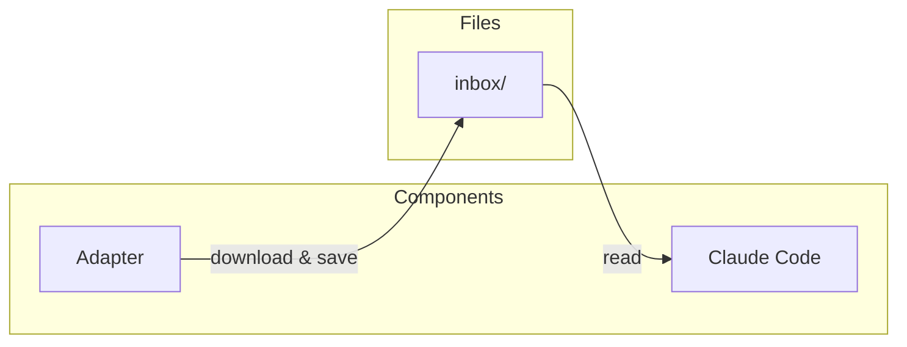

## IPC Protocol

JSON Lines (newline-delimited JSON) over Unix domain socket.

**Plugin to Daemon:**

| Message | Purpose |
|---|---|
| `register` | Claim channels, opt into DMs |
| `tool_call` | Execute adapter tool (reply, react, etc.) |
| `unregister` | Release claims |
| `ping` | Keep-alive |

**Daemon to Plugin:**

| Message | Purpose |
|---|---|
| `register_ack` | Registration result + bot username |
| `tool_result` | Tool call response |
| `pong` | Keep-alive response |
| `inbound` | Routed Discord message |
| `shutdown` | Daemon shutting down |
