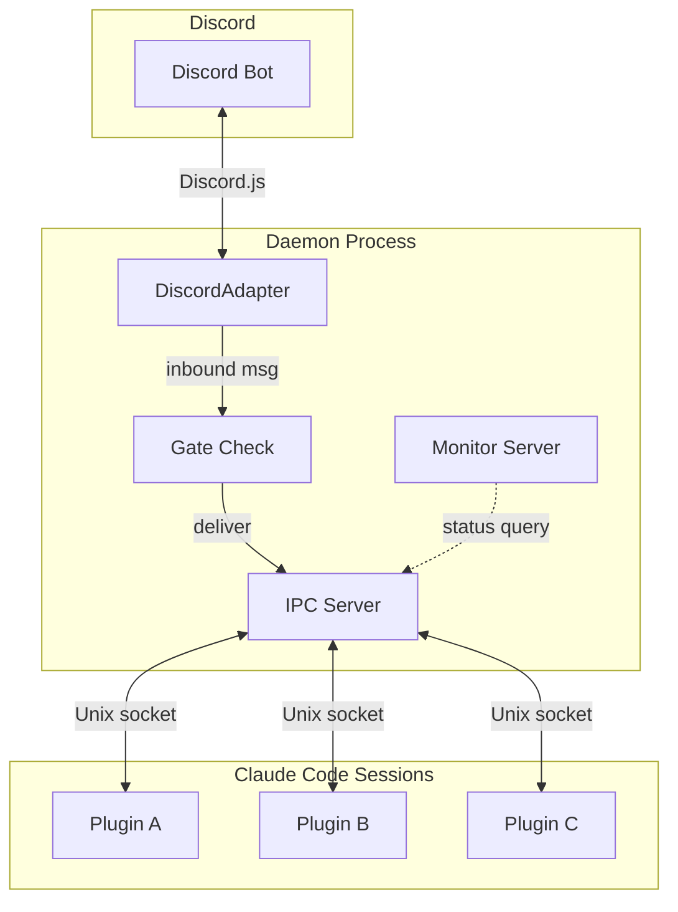
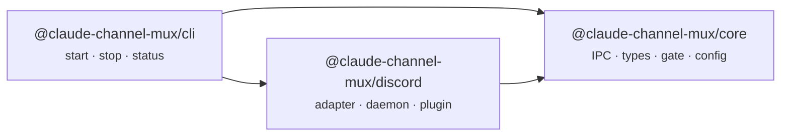
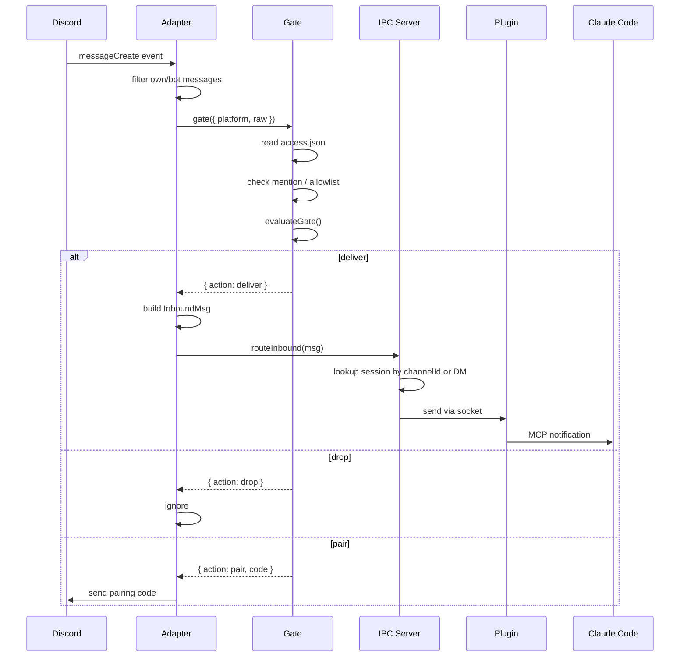
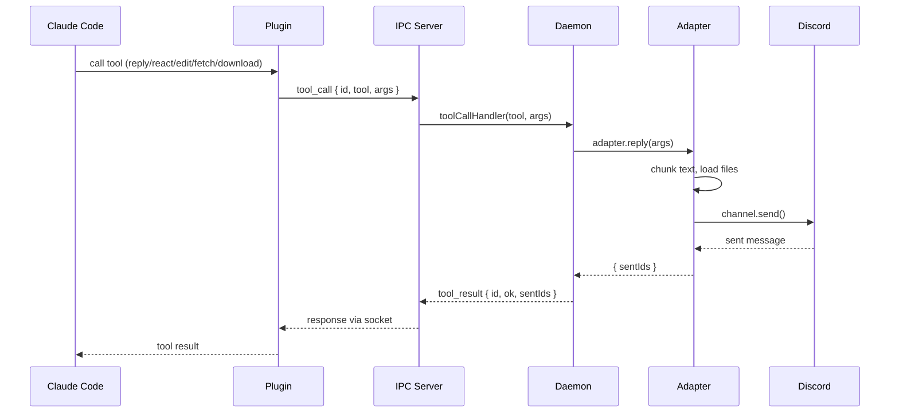
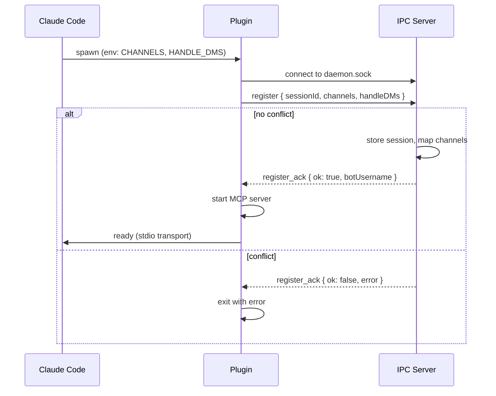
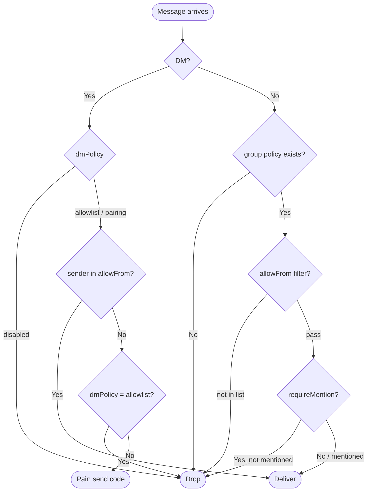
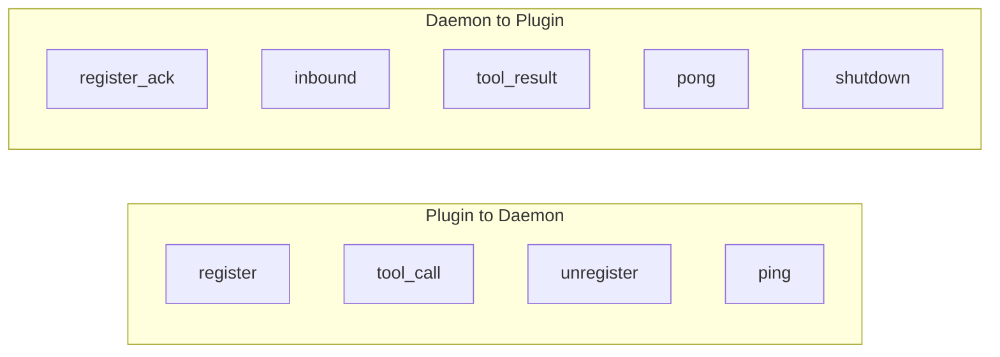

# Architecture

> Overview of the claude-channel-mux system architecture.

## System Overview



The daemon holds a single Discord bot connection and multiplexes messages to multiple Claude Code sessions via Unix socket IPC. Each session runs as an MCP server plugin that connects to the daemon.

## Package Dependency Graph



| Package | Responsibility |
|---|---|
| **core** | Platform-agnostic: IPC protocol, types, gate logic, config paths |
| **discord** | Platform-specific: Discord.js adapter, daemon wiring, MCP plugin |
| **cli** | Daemon process management (start/stop/status) |

## Message Flow: Inbound (Discord to Claude)



## Message Flow: Outbound (Claude to Discord)



## Session Registration



Session claims are exclusive: one session per channel, one session for DMs. Re-registration from the same session ID releases old claims first.

## Access Control (Gate)



Gate logic is pure (no platform deps) in `core/gate.ts`. The Discord adapter resolves mentions and reads `access.json` before delegating to the pure function.

## State Directory

All runtime state lives in `~/.claude/channels/channel-mux/`:

```
~/.claude/channels/channel-mux/
  .env              Bot token (DISCORD_BOT_TOKEN)
  access.json       Access control config
  daemon.pid        Running daemon PID
  daemon.sock       Unix domain socket
  daemon.log        Daemon stderr output
  monitor.port      Monitor server port (if enabled)
  inbox/            Downloaded attachments
  approved/         Pairing approval files
```

## IPC Protocol

JSON Lines (newline-delimited JSON) over Unix domain socket.



| Direction | Message | Purpose |
|---|---|---|
| Plugin to Daemon | `register` | Claim channels, opt into DMs |
| Plugin to Daemon | `tool_call` | Execute adapter tool (reply, react, etc.) |
| Plugin to Daemon | `unregister` | Release claims |
| Plugin to Daemon | `ping` | Keep-alive |
| Daemon to Plugin | `register_ack` | Registration result + bot username |
| Daemon to Plugin | `inbound` | Routed Discord message |
| Daemon to Plugin | `tool_result` | Tool call response |
| Daemon to Plugin | `pong` | Keep-alive response |
| Daemon to Plugin | `shutdown` | Daemon shutting down |
